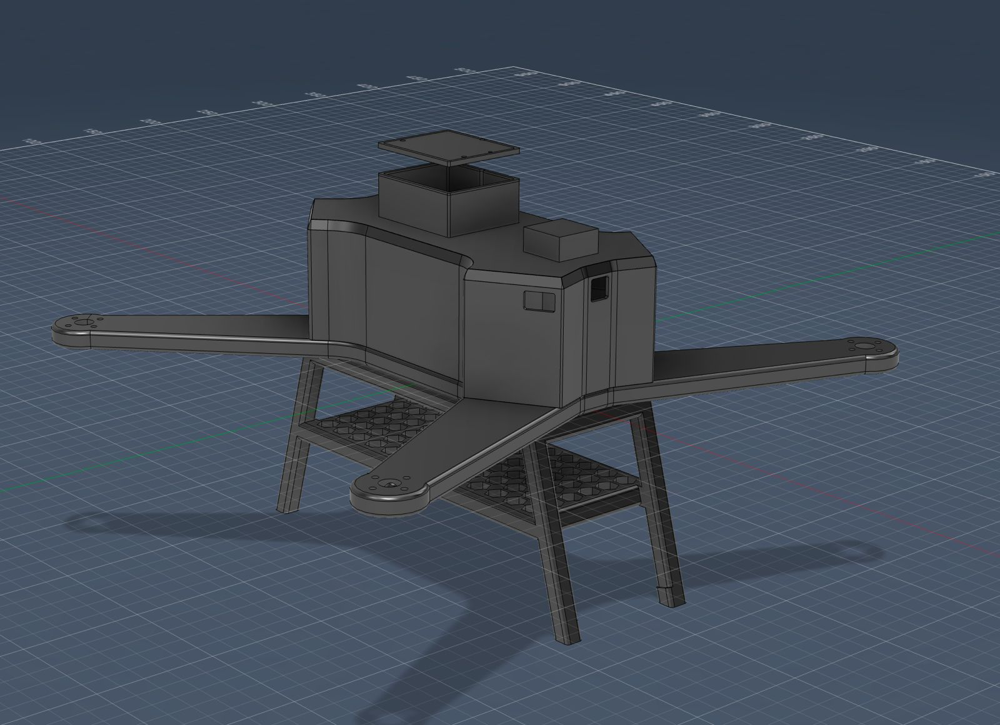
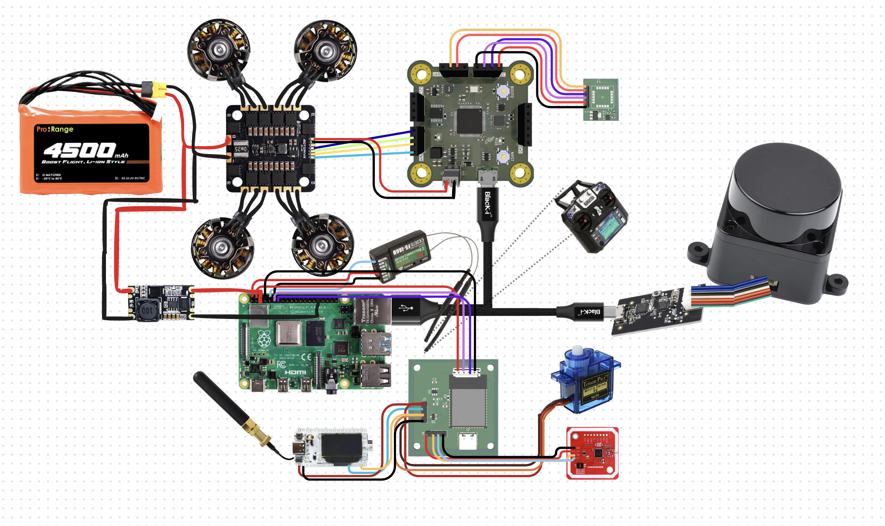

# StreetSafe:
Disaster-response system designed to help people navigate safely during heavy rain and flooding. It improves on traditional GPS by using real-time data to guide users away from unsafe roads. Also the MAIN thing- An autonomous drone that can monitor conditions on the ground, update routes, and assist in search and rescue when situations become bad

So there are 2 parts of our Project, the physical design and drone , and the front end code base:-

# DRONE:
We designed the entire custom model including electronics in fusion and made a wiring diagram including all the components and the wiring.
## What differentiates us?
Due to our goal of a helpful autonomous weatherproof drone, we had to add multiple unique differntiating parts-
1.weatherproofing and waterproofing while maintaining airflow to cool components
2.Constant Lidar sensing on top of the drone to autonomously navigate
3.Payload mechanisms which can easilt be swapped out. for a start we have designed two-
* First Aid and small package deliverer. We designed a payload dropper mechanism to drop first aid boxes in times of flooded rains
* WIFI booster- In tree surrounded areas wifi connectivity gets worse exponentially so our drone acts as a network booster such that people can connect to internet and can call in case of emergencies.

# CODE:
This codebase is split into two main parts:
1. A Raspberry Pi 5 control system that is designed to run on actual hardware -> WARNING! ! ! -> WE DONT HAVE THE PHSYICAL COMPONENTS YET SO THIS IS LIKE A PLACEHOLDER!
2. A simulation (for testing and demoing) and dashboard system that runs in the browser and backend

Both parts implement the same core idea: an autonomous system that moves toward a goal or keep patrol while continuously avoiding obstacles and adapting to its environment.
1. Raspberry Pi (real-world system)
The pi module contains the code intended to run on a Raspberry Pi connected to a drone.
This part of the code:
* Connects to a flight controller using MAVLink
* Reads data from sensors such as LiDAR and distance sensors
* Processes that data to detect obstacles and measure distances
* Runs a control loop that decides how the drone should move
* Sends movement commandsback to the FC

In each cycle, the system:
1. Reads sensor data
2. Determines if the path ahead is clear
3. Adjusts direction if obstacles are detected
4. Continues moving toward the goal
This is the execution layer that would control a real drone.

2. Simulator + Dashboard (testing system)
The backend and frontend modules together act as a simulation environment.
This 
* Simulates the drone’s position and movement on a map
* Allows obstacles and walls to be placed interactively
* Runs the same navigation logic used on the Pi
* Displays everything visually in real time
It handles
* Routing between locations
* Flood-aware path calculation
* System state updates

The frontend:
* Displays the map (Leaflet)
* Shows the drone, its path, and obstacles
* Updates continuously as the system runs

Key ideas:--
* Move toward a goal or post etc.
* Detect obstacles
* Adjust direction dynamically
* Continue until the destination is reached
The simulator is used for testing and visualisaion (looks v cool) , while the Raspberry Pi code is designed to run the same logic on real hardware or atleast i think it will work .

## How to use:
To run: 
In bash
cd ........./streetsafe
./run_demo.sh

Then open:
http://localhost:9000

This starts the backend and launches dashboard where you can see- drone moving, place obstacles, and test navigation.

## Why did we do this? 
where we live-> bangalore gets heavy rains all the time (even in the summer) and its really bad traffic on top of the already infamous bangalore traffic but this can also get quite deadly, so we started this originally as a hackathon project (just some code which is now sitting in Old-website) but then we realised that this could actually be a fun and usefull project and here we are!

## 3D MODEL

## WIRING DIAGRAM

## Bill of Materials
| Item | Specific Part | Unit Price (INR) | Quantity | Total Price (INR) | URL | Running Total |
| :--- | :--- | :--- | :--- | :--- | :--- | :--- |
| Companion computer | Raspberry Pi 5 (4GB) | 0 | 1 | 0 | Nil | 0 |
| Primary LiDAR | LDROBOT D500 | 7,520 | 1 | 7,520 | [Link](https://robu.in/product/ldrobot-dtof-lidar-stl-19p-360-omni-directional-lidar/) | 7,520 |
| FC | Custom PCB | 1,700 | 1 | 1,700 | Nil | 9,220 |
| ESC | BotDrive 8-bit 4-in-1 ESC 50 Amps | 3,599 | 1 | 3,599 | [Link](https://robu.in/product/botdrive-8-bit-4-in-1-esc-50-a/) | 12,819 |
| Motors | Emax ECOII 2807 1300KV | 1,700 | 4 | 6,800 | [Link](https://hitechxyz.in/products/emax-ecoii-2807-1300kv-brushless-motor) | 19,619 |
| Propeller | Gemfan 7040 | 200 | 4 | 800 | [Link](https://hitechxyz.in/products/pro-range-propellers-7040-flash-pc-3-blade-propellers-2cw-2ccw-black) | 20,419 |
| Battery | 6S 4500mAh Li-ion | 4,100 | 1 | 4,100 | [Link](https://robu.in/product/pro-range-inr-21700-p45b-22-2v-4500mah-6s1p-35a-45a-discharge-li-ion-drone-battery-pack/) | 24,519 |
| BEC | 13S 5V BEC For Quad | 741 | 1 | 741 | [Link](https://www.flyrobo.in/yrrc-2-13s-5v-5a-bec-module?tracking=ads) | 25,260 |
| GPS | HGLRC M100 Pro | 1,900 | 1 | 1,900 | [Link](https://robu.in/product/hglrc-m100-pro-gps/) | 27,160 |
| Frame | 3D printed using PETG-CF (cost negligible) | 0 | 1 | 0 | Nil | 27,160 |
| Radio | FS i6 | 0 | 1 | 0 | Already have | 27,160 |
| Antenna | 6dBi 2.4GHz 5GHz Dual Band WiFi SMA Antenna | 62 | 1 | 62 | [Link](https://robocraze.com/products/6dbi-2-4ghz-5ghz-dual-band-wifi-rp-sma-antenna-20cm-u-fl-ipex-cable) | 27,222 |
| WiFi module | ESP32 | 1,400 | 1 | 1,400 | [Link](https://robocraze.com/products/wifi-kit-32) | 28,622 |
| Servo | SG90 | 0 | 1 | 0 | Already have | 28,622 |
| Payload PCB | Custom PCB | 720 | 1 | 720 | Nil | 29,342 |
| NFC Tag | PN532 NFC RFID | 261 | 1 | 261 | [Link](https://www.flyrobo.in/pn532-nfc-rfid-module-v3-kit?tracking=ads) | 29,603 |
| **Total** |  |  |  |  |  | **29,603** |
